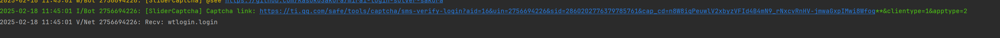
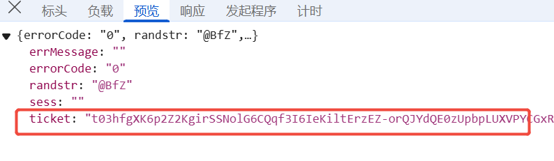
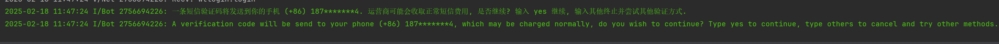

# MyBot
MyBot是一个基于Kotlin和Mirai开发的QQ机器人项目，配置好运行启动即可登录qq开始运行，使用命令行形式进行交互。
注意qq的登录要占用一个设备的登录名额，目前默认选项是在MACOS设备上进行登录，如果需要在其他设备上登录请修改`src/main/kotlin/Main.kt`中的登录配置

目前接入的wiki:
- 星露谷
- 星露谷SVE
- 泰拉瑞亚
- 泰拉瑞亚灾厄

目前接入的AI:
- DeepSeek
- OpenAI

## 第一次登录
第一次登录要在命令行中手动完成登录校验,后续会记录设备信息,下次登录不会再触发校验
1. 运行程序
2. 根据命令行的提示进行输入 相关步骤:

   根据提供的网址复制到浏览器打开,12查看登录校验接口/cap_union_new_verify
   
   完成校验, 注意可能需要第二第三次校验才能得到秘钥

   把这个复制回来输入到命令行中，回车
   

   输入yes获取手机验证码,然后输入验证码
   
3. 登录成功
   


## 特性

- 使用 Kotlin 编写
- 配置管理
- 群组管理
- AI回复
- 游戏WIKI查询

## 快速开始

1. 克隆项目
```bash
git clone https://github.com/kaer-nk/MyBot.git
```

2. 配置
- 复制 `src/main/resources/config.json.example` 到同目录下的 `config.json`
- 修改 `config.json` 中的配置信息

3. 运行
```bash
./gradlew run
```

## 配置说明

在 `config.json` 中配置以下信息：
- qq：机器人QQ号
- password：密码
- groups：允许的群组列表
- 各种AI的配置信息

## 开源许可

本项目采用 MIT 许可证，详情请见 [LICENSE](LICENSE) 文件。